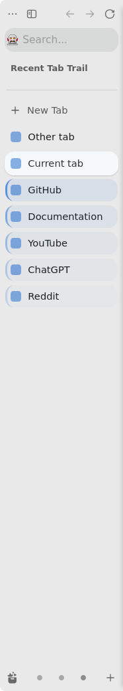
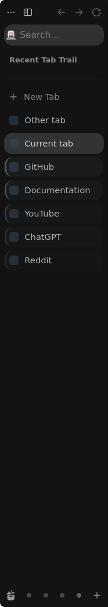
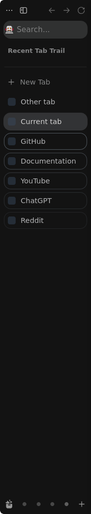
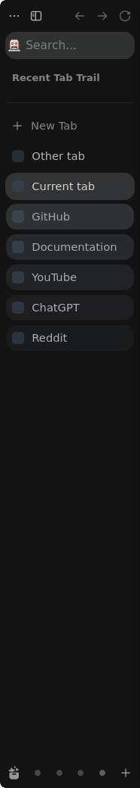

# Recent Tab Trail

See your recently visited tabs in Zen’s sidebar without rearranging them.
The latest previous tab gets the strongest highlight; older visits fade away.
Your selected tab keeps Zen’s normal appearance.

Real Zen 1.23b captures with the Purple preset and Bar + tint:

 

## What it does

- Highlights up to 20 previously visited tabs, configurable from 1 to 20.
- Follows actual tab activation, including mouse and keyboard navigation.
- Works with workspaces, folders, pinned tabs, and Essentials.
- Keeps a separate trail in each window, including private windows.
- Stores settings only. The mod saves no browsing history and makes no network requests.

## Why

**Tab position = spatial organization. Trail intensity = temporal recency.**
Keep your folders and tab positions while seeing where you were just working.

## Installation

Requires Zen Browser, [Sine 2.3.3 or later](https://github.com/sineorg/docs/blob/main/src/installation.md),
and permission for unofficial userChrome JavaScript.

### Sine

In **Sine Mods**, use **Add your own locally from a GitHub repo** and enter:

```text
https://github.com/evgen2571/zen-recent-tab-trail
```

In **Sine settings**, allow JavaScript from unofficial sources, then enable
**Recent Tab Trail** after installation.

### Development / offline installation

With Node.js 22+, use the bundled installer from the checkout after closing Zen:

```sh
node tools/install-local.mjs "/absolute/path/to/Zen/profile"
```

Use an initialized Sine profile. See [installation details](VERIFICATION.md#development--offline-installation).

## Customization

Open Recent Tab Trail’s settings in Sine Mods. Changes apply immediately.

| Setting | Choices | Default |
| --- | --- | --- |
| Number of recent tabs | 1–20 | 5 |
| Workspace history | Current workspace, Global | Current workspace |
| Include pinned tabs / Essentials | Separate switches | Both on |
| Indicator style | Bar + tint, Bar only, Outline, Tint, Solid fill | Bar + tint |
| Color | Zen accent, Purple, Blue, Cyan, Green, Orange, Red, Pink, Custom | Zen accent |
| Custom color | CSS color text; shown only with Custom | `#7c6cff` |
| Intensity | Subtle, Normal, Strong | Normal |

The count is the maximum number of previous eligible tabs shown in the trail.
Decimals round to the nearest integer; values clamp to 1–20. Empty, non-numeric,
or non-finite values use 5. Presets cover common accent colors. Custom accepts any valid
standalone CSS color, for example
`#ff6b6b`, `rgb(120 90 255)`, or `hsl(260 90% 65%)`. Invalid colors fall back to
Zen’s accent. All ranks use the same base color, fading automatically with age.
Solid fill stays translucent, even with Strong intensity.

Outline and Solid fill with the Purple preset, shown in dark mode:

 

## Compatibility

Tested with Zen 1.23b Linux and Sine 2.3.3 in a disposable profile. Native hover,
selection, tab controls, and tab positions are preserved. No build step or runtime
dependencies are required. Firefox compatibility is not claimed.

## Known limitations

- Restored recency depends on native session metadata; old background tabs and
  equal timestamps can be ambiguous.
- Hidden tabs and collapsed folder members do not consume ranks. Global workspace
  history can leave gaps in the currently visible trail.
- Very light or dark custom colors can be faint against a matching sidebar.
- Windows/macOS, third-party themes, and native drag/audio/container combinations
  still need manual visual checks. Recency is supplementary to native focus and selection.

## Development

With Node.js 22+:

```sh
node --check recent-tab-trail.uc.js
node --check tools/install-local.mjs
node --test tests/*.test.cjs
```

GitHub Actions runs these checks on Linux with Node 24. Boundary tests do not
verify browser rendering. See [VERIFICATION.md](VERIFICATION.md) for native behavior,
preference keys, live browser results, installation details, and manual checks.

## License

[MIT](LICENSE).
